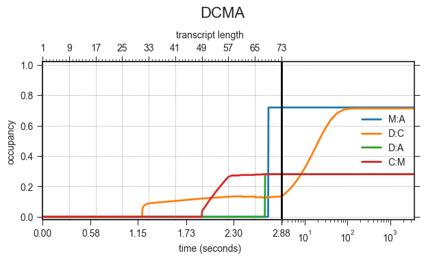

# DrTransformer -- heuristic cotranscriptional folding.
[](https://badge.fury.io/py/drtransformer)
[](https://opensource.org/licenses/MIT)

[](https://codecov.io/gh/bad-ants-fleet/drtransformer)

DrTransformer (short for "DNA-to-RNA transformer") is a program for heuristic
and deterministic cotranscriptional folding simulations of RNA molecules. The
code of this project is available under MIT license, however this software
depends on the [ViennaRNA] package which is available through the [ViennaRNA
license].

## Installation
If you already have the Python bindings of the [ViennaRNA] package installed,
then the latest stable release of DrTransformer can be installed from PyPI:
```sh
  ~$ pip install drtransformer
```

DrTransformer can also be installed with bioconda to resolve the [ViennaRNA]
dependency automatically. First, make sure [bioconda] is set up properly with:
```sh
  ~$ conda config --add channels defaults
  ~$ conda config --add channels bioconda
  ~$ conda config --add channels conda-forge
  ~$ conda config --set channel_priority strict
```
Second, install or update your DrTransformer installation.
```sh
  ~$ conda install drtransformer
```

### Testing/Contributing
To install the latest development version of DrTransformer, clone the
repository and run:
```sh
  ~$ pip install .[dev]
```
Use the following command to run all present unittests:
```sh
  ~$ python -m pytest 
```
Please provide unittests if you are submitting a pull request with a new feature.

## Usage
Until further documentation is available, please use the *--help* options of the 
command line executables:
```sh
  ~$ DrTransformer --help
  ~$ DrPlotter --help
```

### An example cotranscriptional folding simulation
We show simulations of three sequences designed by [Xayaphoummine et
al. (2006)].  Briefly, two sequences are composed of the same palindromic
subsequences (A, B, C, D) in forward and reverse order (`ABCD` and `DCBA`); the
third sequence (`DCMA`) has a point mutation which changes B to M. The
experiment demonstrates how the order of helix formation determines which
structures are formed at the end of transcription, an effect that cannot be
observed with a thermodynamic equilibrium prediction, because the free energies
of, for example, the helices A:B and B:A are almost the same due to their
palindromic subsequences.  The three input files [`ABCD.fa`], [`DCBA.fa`] and
[`DCMA.fa`] contain a fasta header and the respective sequence from the
original publication.  Those files can be found in the subfolder [`examples/`]. 

```sh
  ~$ cat ABCD.fa | DrTransformer --name ABCD --o-prune 0.01 --logfile 
```
This command line call of DrTransformer produces two files:
 - `ABCD.log` contains a human-readable summary of the cotranscriptional folding process. 
 - `ABCD.drf` contains the details of the cotranscriptional folding simulation in the
 [DrForna] file format. 

#### Structure-based data analysis
DrPlotter supports different types of visual analysis for the `.drf` file
format. The following command line call reads the previously generated file
`ABCD.drf` and produces a plot called `ABCD.png`.
```sh
  ~$ cat ABCD.drf | DrPlotter --name ABCD --format png
```


The legend of `ABCD.png` must be interpreted in combination with the `ABCD.log`
file. **Note that the structure IDs from your newly generated files might not
match the ones shown here.** For example, to see which structures are shown at
the simulation of nucleotide 73, read the log file entries for this transcript
length:
```
73    1 .(..(((((((((((((((....)))))))))))))))..).(((((((((.......)))))))))...... -42.60 +[0.0213 -> 0.9876] ID = 24
73    2 ....(((((((((((((((....))))))))))))))).(..(((((((((....)).)))))))..)..... -39.90 -[0.9787 -> 0.0124] ID = 25
```
The logfile lists two structures (in order of their free energy), it shows
their occupancy at the start of the simulation and at the end of a simulation
in square brackets, and it provides the ID to follow a specific structure
through the transcription process (+/- indicate a change in occpancy). The IDs
are used as labels in the plot `ABCD.png`.

### Motif-based data analysis
Instead of following specific structures, it is often more helpful to visualize
when specific helical motifs are formed in the ensemble. Generally, we refer to
a helix formed from sequences A and B as A:B, etc. All potential helices 
plotted here are provided in dot-bracket notation in the files [`ABCD.motifs`], [`DCBA.motifs`] and [`DCMA.motifs`].
```sh
  ~$ cat ABCD.drf | DrPlotter --name ABCD-motifs --molecule ABCD --format png --motiffile ABCD.motifs --motifs A:B C:D A:D B:C
  ~$ cat DCBA.drf | DrPlotter --name DCBA-motifs --molecule DCBA --format png --motiffile DCBA.motifs --motifs B:A D:C D:A C:B
  ~$ cat DCMA.drf | DrPlotter --name DCMA-motifs --molecule DCMA --format png --motiffile DCMA.motifs --motifs M:A D:C D:A C:M
```
<br>
ABCD forms only structures A:B and C:D but not A:D and B:C. Also, helix C:D is
not formed "immediately", because there is a competing structure which
is cotranscriptionally favored (see ID 25 from the previous anlysis).

<br>
DCBA forms structures with all motifs. The helical structures C:B and
D:A dominate with more than 90%, the helices D:C and B:A are
below 10% of the population. Eventually, D:C and B:A will be
dominant, but not on the time scale simulated here. (Can you repeat the analysis
to see how much time it needs until D:C and B:A dominate the ensemble?)

<br>
As shown in the publication, a single point mutation (from DCBA to DCMA) is
sufficient to drastically shift occupancy of helices: M:A and D:C
are more occupied at the end of transcription than D:A and C:M.

### Tips and tricks
 - The header of the logfile contains all relevant DrTransformer parameters that generated the file. 
 - You can use the parameter `--plot-minh` to group similar structures (separated by energy barriers < plot-minh) together. 
    In contrast to the `--t-fast` parameter, this will not affect the accuracy of the model.
 - Use `--pause-sites` to see the effects of pausing at specific nucleotides on cotranscriptional folding.
 - Motifs for DrPlotter can also contain 'x' in the dot-bracket notation for *must be unpaired*.

## Cite
Stefan Badelt, Ronny Lorenz, Ivo L Hofacker: **DrTransformer: heuristic
cotranscriptional RNA folding using the nearest neighbor energy model**, 
Bioinformatics, Volume 39, Issue 1, January 2023, 
[https://doi.org/10.1093/bioinformatics/btad034]

[//]: References
[ViennaRNA]: <http://www.tbi.univie.ac.at/RNA>
[ViennaRNA license]: <https://github.com/ViennaRNA/ViennaRNA/blob/master/license.txt>
[bioconda]: <https://bioconda.github.io>
[DrForna]: <https://github.com/ViennaRNA/drforna>
[Xayaphoummine et al. (2006)]: <https://doi.org/10.1093/nar/gkl1036>
[https://doi.org/10.1093/bioinformatics/btad034]: <https://doi.org/10.1093/bioinformatics/btad034>
[`examples/`]: <examples>
[`ABCD.fa`]: <examples/ABCD.fa>
[`DCBA.fa`]: <examples/DCBA.fa>
[`DCMA.fa`]: <examples/DCMA.fa>
[`ABCD.motifs`]: <examples/ABCD.motifs>
[`DCBA.motifs`]: <examples/DCBA.motifs>
[`DCMA.motifs`]: <examples/DCMA.motifs>
